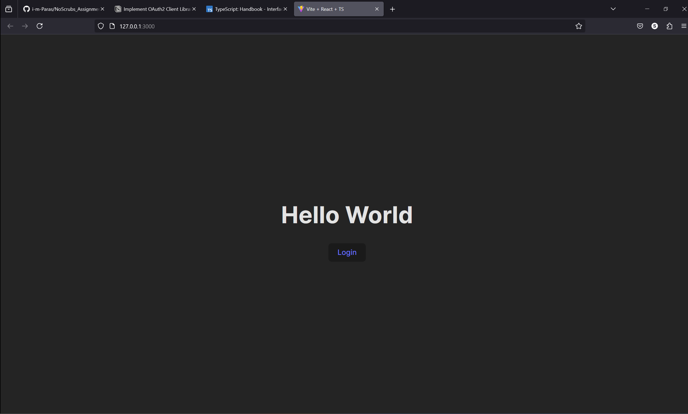
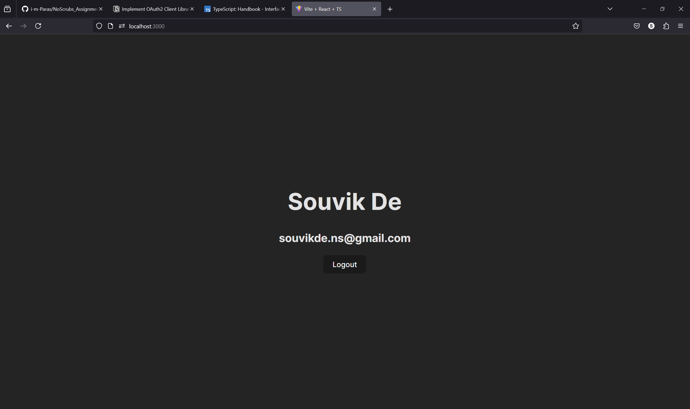

# OAuth 2.0 library / NoScrubs Assignment

This library contains a OAuth 2.0 library that runs both on browser and on nodejs.


## File Structure
```
|-auth // Auth Library 
|   |-src
|   |   |-index.ts
|-demo // client demo built using vite and react
|-server-demo // express application running on nodejs.
```

## Installation
1. clone the repository
2. move to the `auth` folder `cd auth`
3. build the auth library `npm run build`

## API Usage

`Auth` is a library that makes your Auth 2.0 flow easy. It generates authentication url and handles callback along side fetching user data.


#### Installation and Setting up
```ts
import { createAuthClient } from 'auth'

const authClient = createAuthClient({
    domain: process.env.DOMAIN,
    client_id: process.env.CLIENT_ID,
    redirect_uri: 'http://localhost:3000/api/callback',
    scope: 'openid profile email',
    client_secret: process.env.CLIENT_SECRET
})
```

#### Function Supported by `Auth`


```ts

// async startAuthFlow(): string 
const url = authClient.startAuthFlow()

// async handleCallback(code: string): Promise<string>
const access_token = await authClient.handleCallback(code)

// async getUserInfo(access_token: string): Promise<any>
const user = await authClient.getUserInfo(access_token)

// async refreshToken(refresh_token): Promise<string>
const access_token = await authClient.refreshToken(refresh_token)

```

### Extend OAuth library to add new functions or update existing functions.

`Auth` library is built in a way that it is very easy to extend and modify. The library exports an `ProviderInterface` which users can use to modify entire library with custom functionalities. The library also exports `Provider` class to extend and add new functions or modify the existing ones.


Lets look at an example to how we can extend the `OAuth` library to add a new function called `logout`.

```ts
import { Provider } from 'auth'

class Auth extends OAuth {
    async function logout() {
        // Implement custom logic for logging out
    }
}

const auth = new Auth({
    domain: process.env.DOMAIN,
    client_id: process.env.CLIENT_ID,
    redirect_uri: 'http://localhost:3000/api/callback',
    scope: 'openid profile email',
    client_secret: process.env.CLIENT_SECRET
})

await auth.logout()

```

You can even implement the `ProviderInterface` to change all the functions. 

```ts
import {ProviderInterface} from 'auth'

class Auth implements ProviderInterface {
    // Implment all the functions and add custom logic.
}

const auth = new Auth()

auth.startAuthFlow()

```


## Demo 

We have two demo one that runs on browser using vite and reactjs and other using express. Both demo implement the `auth` library to showcase it's usage.


### Client Demo

Steps:

- `cd demo`
- `npm install` to install the dependencies 
- `npm run dev` to spin the development server with vite.

we have a login button redirects you to the auth url where you will complete your OAuth 2.0 login and then you will be redirected to the `localhost:3000/api/callback` where we use the code and fetch `access_token` that we save the secure cookie and redirect you to the home page, where we fetch user details and render them.






### Server Demo

Steps:

- `cd server-demo`
- `npm install` to install the dependencies 
- `node index.js`

To start the login process make an http call to `localhost:3000/login` which will redirect you to auth url where you will complete your OAuth 2.0 login and then you will be redirected to `localhost:3000/api/callback` where we fetch the `access_token` and fetch the user details and then save necessary data to session and then redirect you to `localhost:3000/`.
